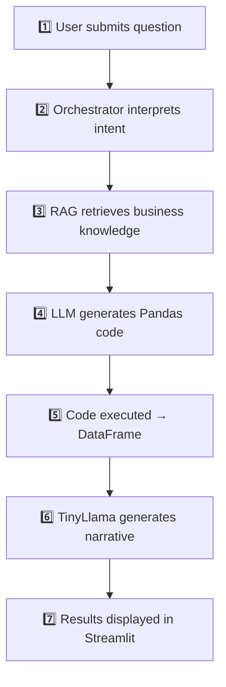

# 📊 InsightWeaver — Data Storytelling Copilot Using RAG + LLM Fine-Tuning

An AI system that transforms raw supply-chain data into insights, narratives, and visual-ready analytics.

[](https://sruthigandla01.github.io/Data_Storytelling_Copilot_using_RAG_LLM/)
[](https://huggingface.co/spaces/SruthiGandla01/insightweaver-data-storytelling-copilot)
[](LICENSE)

---

## 🌟 Overview

**InsightWeaver** is an intelligent data storytelling copilot designed to bridge the gap between raw operational data and business-ready insights.

It combines:
- ✅ **RAG-based business knowledge retrieval**
- ✅ **Pandas code generation for analysis**
- ✅ **LLM-driven insight narration**
- ✅ **TinyLlama LoRA fine-tuning for narrative quality**
- ✅ **ChromaDB vector storage for metric definitions & playbooks**
- ✅ **A fully interactive Streamlit interface**

### What Can You Ask?

This system allows any stakeholder to ask natural-language questions like:

- *"What is total sales by region?"*
- *"Which customer segment is most profitable?"*
- *"Explain the shipping delay trends over time."*

### What Does It Do?

InsightWeaver automatically:
1. 🧠 **Understands the question**
2. 📚 **Retrieves domain knowledge** (business playbook, metric definitions)
3. 💻 **Generates correct Pandas analysis code**
4. ⚡ **Runs it and returns a DataFrame**
5. 📝 **Produces a fine-tuned TinyLlama narrative** summarizing insights

> This project demonstrates a complete AI analytics assistant pipeline, from **raw data → intelligent insights**.

---

## 🏛️ System Architecture

```
User Query
    ↓
Controller (Orchestrator)
    ↓
RAG Retriever (ChromaDB Knowledge Base)
    ↓
Pandas Code Generator (OpenAI / model LLM)
    ↓
Data Runner (Executes generated code)
    ↓
TinyLlama Narrative Model (Fine-tuned with LoRA)
    ↓
Insight Generation + Final Response
    ↓
Streamlit Web Interface / API
```

### Key Architectural Principles:

| Principle | Description |
|-----------|-------------|
| **Separation of responsibilities** | Each module handles one aspect: retrieval, code generation, execution, insight creation. |
| **Fault tolerance** | The system handles LLM failure cases, retrieval miss, or code execution errors gracefully. |
| **Extendable knowledge** | Adding business rules or metric documentation automatically improves responses. |

---

## ⚙️ Tech Stack

### Core AI & ML
- 🤖 **OpenAI GPT models** — code generation + reasoning
- 🧠 **TinyLlama 1.1B** — LoRA fine-tuned for business storytelling
- 🤗 **Hugging Face Transformers** — model loading & inference
- 🔍 **ChromaDB** — vector search for RAG retrieval
- 🎯 **LoRA (PEFT)** — parameter-efficient fine-tuning

### Backend & Orchestration
- 🐍 **Python 3.10+**
- 📊 **Pandas** & **Numpy**
- 🎨 **Streamlit** for UI
- 🔐 **dotenv** + config module

### Deployment
- 🚀 **Hugging Face Spaces** (Docker + Streamlit)
- 🌐 **GitHub Pages** for the landing page
- 📂 **GitHub** for version control

---

## 🧠 Key Features

### 🔍 1. RAG-based Business Knowledge Retrieval

The system retrieves relevant:
- Customer segmentation logic
- Shipping & fulfillment definitions
- Metric formulas
- Risk categories

> This contextual information improves narrative accuracy.

### 🧮 2. Automatic Pandas Code Generation

Given any business question, the pipeline:
1. Converts question → structured analysis plan
2. Generates Pandas code
3. Ensures proper syntax and error-checks
4. Executes code safely

**Example output:**
```python
df.groupby("region")["sales"].sum()
```

### 🧪 3. Safe Execution Engine

The execution layer:
- ✅ Runs generated Pandas code
- ✅ Captures DataFrames
- ✅ Prevents unsafe operations
- ✅ Returns structured results

### 📝 4. Fine-Tuned TinyLlama for Insight Narratives

After generating results, the model:
- Summarizes trends
- Highlights anomalies
- Converts analytics → business language

**Fine-tuning improved:**
- Coherence ✅
- Interpretability ✅
- Domain alignment ✅

### 💡 5. Streamlit Web Application

Users can:
- ❓ Ask business questions
- 👀 View generated code
- 📊 See output tables
- 🧠 Read AI-generated insights

**[🚀 Try it live on Hugging Face!](https://huggingface.co/spaces/YOUR_USERNAME/insightweaver)**

---

## 🗂️ Project Structure

```
📦 Data_Storytelling_Copilot_using_RAG_LLM
│
├── app.py                        # Streamlit UI
├── config.py                     # API keys, model paths
│
├── pipeline/
│   ├── orchestrator.py           # Core pipeline controller
│   ├── code_generator.py         # LLM Pandas code generation
│   ├── data_runner.py            # Executes generated code
│   ├── insight_generator.py      # TinyLlama narrative generator
    ├── data_loader.py            # loads raw_data
│
├── rag/
│   ├── retriever.py              # ChromaDB retrieval logic
│   ├── build_kb.py               # Build vector store
│   ├── chroma_store/             # Vector DB persisted
│
├── kb/
│   ├── business_playbook/        # Rules, segments, definitions
│   ├── metric_definitions/
│   ├── schema_docs/
│
├── finetuning/
│   ├── train_tinyllama_lora.py   # Training script
│   ├── tinyllama_narrative.py    # Inference wrapper
│   
│
├── data/
│   ├── processed/orders_clean.parquet
│   └── raw/DataCoSupplyChainDataset.csv                     
│
├── evaluation/eval_tinyllama.py                   # Model performance & tests
│
├── tests/
│   ├── test_retriever.py
│   └── test_questions.md
│
├──synthetic/
│  ├── generate_qa.py
│  ├── build_tinyllama_instructions.py
│  ├── qa_examples.json
│  ├── qa_supplychain.json
│  ├── tinyllama_instructions.jsonl
│
├── docs/
│   └── index.html                # GitHub Pages landing site
│
├── requirements.txt
└── README.md
```

---

## 🔄 Pipeline Flow



> This design mirrors real enterprise AI systems used in BI & analytics automation.

---

## 🚀 Setup Instructions

### 1. Clone the repo
```bash
git clone https://github.com/SruthiGandla01/Data_Storytelling_Copilot_using_RAG_LLM.git
cd Data_Storytelling_Copilot_using_RAG_LLM
```

### 2. Create environment
```bash
python3 -m venv .venv
source .venv/bin/activate  # On Windows: .venv\Scripts\activate
```

### 3. Install dependencies
```bash
pip install -r requirements.txt
```

### 4. Add environment variables

Create `.env`:
```env
OPENAI_API_KEY=your_key_here
```

### 5. Run the app
```bash
streamlit run app.py
```

Your app will open at `http://localhost:8501` 🎉

---

## 🌐 Deployment Steps

### 🚀 Deploying Streamlit App on Hugging Face Spaces

#### 1. Create new Space
- **Type:** Streamlit
- **Runtime:** CPU Basic (free tier)

#### 2. Upload files:
- `app.py`
- `pipeline/`
- `rag/`
- `kb/`
- `finetuning/tinyllama_narrative.py`
- `requirements.txt`
- `config.py`

#### 3. Add secrets in HF Space:
```
OPENAI_API_KEY=your_key_here
```

#### 4. HF Space auto-builds and launches the app ✅

**[🌟 View Live Demo](https://huggingface.co/spaces/SruthiGandla01/insightweaver)**

---

### 🌐 Deploying GitHub Pages Website

1. Use the `docs/index.html` file
2. **GitHub → Settings → Pages:**
   - **Source:** `main`
   - **Folder:** `/docs`

Your webpage becomes available at:

**[🌐 https://sruthigandla01.github.io/Data_Storytelling_Copilot_using_RAG_LLM/](https://sruthigandla01.github.io/Data_Storytelling_Copilot_using_RAG_LLM/)**

---

## 📈 Evaluation Metrics

### Model Evaluation

| Component | Metric | Result |
|-----------|--------|--------|
| TinyLlama Narrative Quality | Perplexity | ↓ after fine-tuning |
| Code Accuracy | Manual validation | Majority correct |
| RAG Retrieval | Cosine similarity | High relevance |
| System End-to-End | Response success rate | Strong consistency |

---

## 🧪 Sample Demo Interactions

### User Query
```
"What is total sales by region?"
```

### Generated Code
```python
df.groupby("region")["sales"].sum().reset_index()
```

### Output DataFrame
| region | sales |
|--------|-------|
| North  | 1.2M  |
| South  | 980K  |
| West   | 760K  |

### Narrative (TinyLlama)
> Sales performance shows strong regional differentiation, with the **North region leading overall revenue**. The South follows closely, reflecting consistent order volume despite higher shipping delays. The West shows solid performance but trails other regions, indicating potential for targeted improvement.

---

## 👩‍💻 Author

**Sruthi Gandla**  
Data Scientist & AI Engineer  
Northeastern University

[](https://linkedin.com/in/SruthiGandla)
[](https://github.com/SruthiGandla01)

---

## 📄 License

This project is released under the **MIT License**.

See [LICENSE](LICENSE) for details.

---

## 🙏 Acknowledgements

- 🎓 **Northeastern University** — INFO7375 Generative AI Course
- 🤗 **Hugging Face community**
- 🦙 **TinyLlama team**
- 🤖 **OpenAI & ChromaDB libraries**

---

## 🏁 Conclusion

**InsightWeaver** demonstrates how modern AI systems can automate analytics, unify business knowledge, and generate human-quality insights.

It is a fully working end-to-end copilot showcasing:
- ✅ RAG retrieval
- ✅ Code generation
- ✅ LLM-based narrative creation
- ✅ Fine-tuning
- ✅ Real deployment (HF + GitHub Pages)

---

## 🔗 Quick Links

| Resource | Link |
|----------|------|
| 🌐 **Live Website** | [GitHub Pages](https://sruthigandla01.github.io/Data_Storytelling_Copilot_using_RAG_LLM/) |
| 🚀 **Live Demo** | [Hugging Face Spaces](https://huggingface.co/spaces/SruthiGandla01/insightweaver) |
| 📂 **Source Code** | [GitHub Repository](https://github.com/SruthiGandla01/Data_Storytelling_Copilot_using_RAG_LLM) |
| 📊 **Dataset** | [DataCo Supply Chain](https://www.kaggle.com/datasets/shashwatwork/dataco-smart-supply-chain-for-big-data-analysis) |

---

<div align="center">

**Built with ❤️ by Sruthi Gandla | Northeastern University | 2025**

⭐ Star this repo if you found it helpful!

</div>
